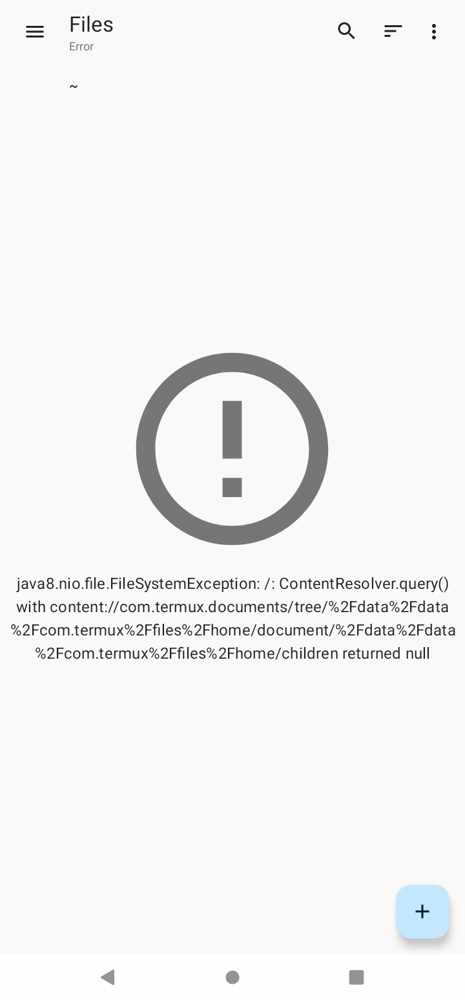
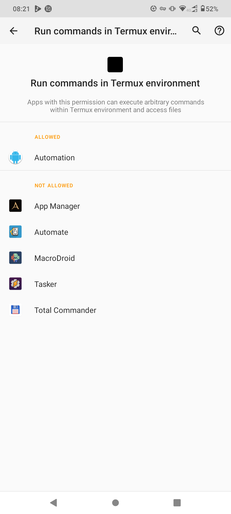
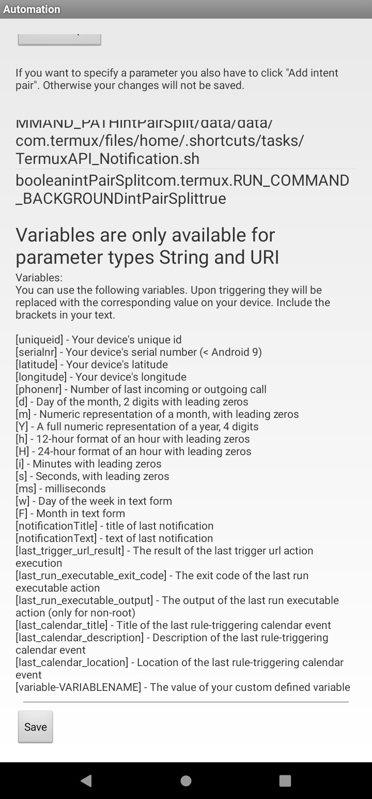
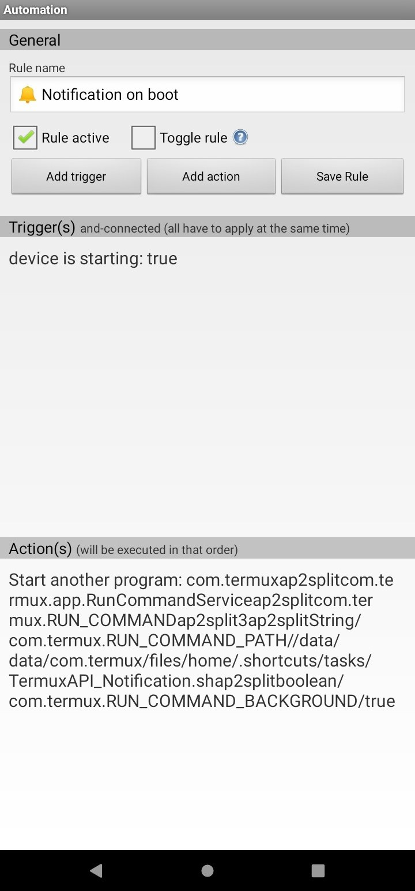
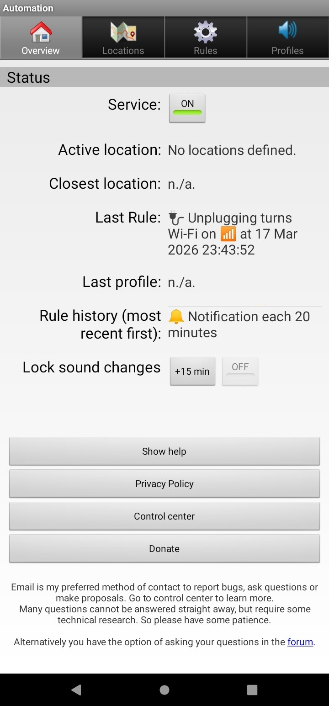
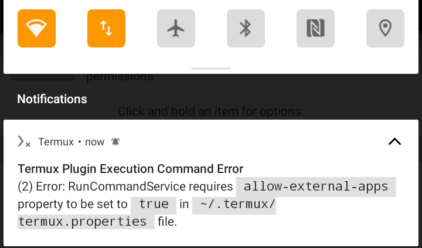

# Termux Plugins & Automation

This repo is dedicated to franek from https://forum.server47.de/viewtopic.php?p=34 who I noticed asked for it.
	I was going to publish this repo anyway regardless, though the interest in it motivated me to publish it earlier.

Here's how I automate Termux scripts silently in the background using the Automation app (com.jens.automation2), easily, no root, no clickbait, no problems:

# Step 1 - gather the ingredients for this recipe, the apps that I use, that work for me:
These are the apps I installed for this to work:
<br>Termux, [Termux:API](https://reports.exodus-privacy.eu.org/en/reports/com.termux.api/latest), [Termux:Widget](https://reports.exodus-privacy.eu.org/en/reports/com.termux.widget/latest), [Automation](https://reports.exodus-privacy.eu.org/en/reports/com.jens.automation2/latest),
	[File/zip manager 2025](https://reports.exodus-privacy.eu.org/en/reports/com.sobha.filemanager/latest), [BeauTyXT](https://beautyxt.app).

Install Termux and its plugins from either F-Droid or GitHub, not the Google Play Store!
<br>Termux from the Google Play Store is notoriously bad. I won't explain it here. Look it up or ask an AI if you're curious.

I installed Termux, and its plugins and Automation using [Droid-ify](https://reports.exodus-privacy.eu.org/en/reports/com.looker.droidify/latest).

The other 2 apps aren't available on F-Droid, so I installed the File/zip manager 2025 from the Google Play Store and<br>BeauTyXT from Accrescent 🌙.
Technically there are other File Manager apps that can be used here.<br>I discuss those in step 3, and why I prefer to just use the File/zip manager 2025 app.

# Step 2, let's get the Termux:API plugin to work:
The Termux:API plugin gives Termux admin-level powers over hardware sensors.
<br>PC terminals normally natively have these powers, but on Android, apps are sandboxed,
<br>so this plugin helps make Termux as powerful as a PC terminal without root.

The Termux:API plugin has two uses for me: testing, and setting conditions inside scripts.
<br>I will use it here as feedback to demonstrate running scripts in Termux.
<br>To get the Termux:API plugin to work, after installing it, enter this line in Termux:

```sh
pkg install termux-api
```

It'll take several seconds to find a mirror to download what's needed to get it operational.
<br>Now enter some of these lines in Termux to test that the Termux:API works and appreciate some of what it can do:

```sh
termux-vibrate

termux-notification -t "This is a custom Termux Notification! 🔔" -c "Executed at $(date +%H:%M:%S)"

termux-toast "This is a custom Termux Toast! 🔔 Executed at $(date +%H:%M:%S)"

# 🔋 Battery level in %
termux-battery-status | grep '"percentage"' | cut -d':' -f2 | tr -d ' ,'

# Is the phone plugged & charging? 🔌
termux-battery-status | grep '"plugged"' | cut -d'"' -f4

# Toggle the flashlight 🔦
termux-torch on
termux-torch off

# Toggle Wi-Fi 📶
termux-wifi-enable false
termux-wifi-enable true

# Add the -h flag to each of these to learn how to use it, e.g. 
termux-notification -h
termux-toast -h

[ $(termux-battery-status | awk -F'[:,]' '/"percentage"/{print $2}') -gt 79 ] && termux-vibrate # Vibrate if the battery 🔋 % is greater than 79%. Play around with it, switch 79 to another % and `termux-vibrate` to `termux-torch on` or `echo "true"` to return text, etc. This can set conditions to execute scripts based on conditions like having enough battery left.

[ "$(ping -c 1 -W 1 8.8.8.8 2>/dev/null | awk '/1 received/ {print 1}')" = "1" ] && echo "WAN Connected"

[ "$(termux-wifi-connectioninfo 2>/dev/null | awk '/"COMPLETED"/ {print 1}')" = "1" ] && echo "WiFi connected, not just on"

[ "$(/system/bin/ip addr 2>/dev/null | awk '/inet / && !/127.0.0.1/ {print 1; exit}')" = "1" ] && echo "LAN Connected" # This effectively tests if Airplane mode ✈️ is on or not at home.

```
Here's the official list of all the other things that the Termux:API plugin can do: https://wiki.termux.dev > [Termux:API](https://wiki.termux.dev/wiki/Termux:API).

# Step 3 - Set up the Termux:Widget plugin and test it by executing a .sh in Termux:
The Termux:Widget plugin, as with all the Termux plugins, is entirely optional for this plan of automating Termux.
<br>But, why not include it?

The Automation app lacks a widget, so lets use this as its widget, letting you execute scripts both automatically with the Automation app,
	and also manually from your phone's home screen with the widget.
To set up the Termux:Widget plugin, you'll need to make a '.shortcuts' folder where you'll put the executable scripts.
If you want Termux:Widget to run .sh scripts in Termux silently in the background,
	meaning not open a new Termux tab or use an existing tab, you'll new a 'tasks' subfolder.
To create both at the same time, and set them up such that all .sh inside them, present and future, are executable, run these lines in Termux:

```sh
mkdir -p ~/.shortcuts/tasks
chmod 700 -R ~/.shortcuts
```

Don't worry if you run either of these lines multiple times,
	in case you forget if you already ran one already or already created either the folder or subfolder manually, these would just be ignored then.

To view, rename, create and delete these folders, as well as to copy or cut (move) and paste .sh files into these folders,
	you can technically enter commands in Termux but it's more comfortable for me and many if not most people to use File Manager and Text Editor apps.

The only thing you can't edit with these apps is turning the scripts to be executable. For this you need the 'chmod' line above.

I decided to select [BeauTyXT](https://beautyxt.app) as my Text Editor of choice because it can open various text file formats and it auto-saves.

I couldn't find any ideal File Manager, so here's a comparison table of the only 4 free privacy-respecting (no trackers & no data collection) File Manager apps
	I found on Android that can mount Termux via the SAF:

|Criteria \ App|[File/zip manager 2025](https://reports.exodus-privacy.eu.org/en/reports/com.sobha.filemanager/latest)|[Ghost Commander](https://reports.exodus-privacy.eu.org/en/reports/com.ghostsq.commander/latest)|[Files](https://reports.exodus-privacy.eu.org/en/reports/com.marc.files/latest)|[FX](https://reports.exodus-privacy.eu.org/en/reports/nextapp.fx/latest)|
|:-:|:-:|:-:|:-:|:-:|
|Icon|||||
|App Store|Google Play Store|F-Droid|Google Play Store|Google Play Store|
|Byte Size (MB)|20|12|0.15|32|
|How to mount Termux using the SAF|☰ > '➕ Add storage...' > 'External storage' > ☰ > 'Termux' > 'USE THIS FOLDER' > 'ALLOW' > 'home'|Just click on<br>'Storage Access Framework'<br>from the home page|☰ > 'Termux'|⋮ > 'Connect to Storage' > 'Termux' > 'USE THIS FOLDER' > 'ALLOW'|
|How to show hidden dotfiles|Click on ⋮ ><br>tick 'Show hidden files' ☑️|Click on the '📄✔' symbol just to the left of ⋮ ><br>tick 'Hidden' ☑️|Click on ⋮ ><br>click on 'Show hidden files'|Enter any folder ><br>click on ⋮ > 'Show Hidden'|
|📋 Easily Copy, Cut (Move) ✂️ & Paste files and folders|✔️|❌<br>Requires copying the destination path to clipboard and pasting it when asked where to paste files|✔️|✔️|
|📝 Can open all text files in BeauTyXT|✔️|✔️|❌<br><br>Only .sh|❌<br>Only opens BeauTyXT and all other Text Editors in read-only mode. FX has its own Text Editor, but it doesn't auto-save and often fails to save at all!|
|🗂️ Can create files & folders, and rename them & |✔️|✔️|❌<br>Can't create new files or rename|✔️|
|Auto-updates without needing to go to another folder and then back or pull down|❌|✔️|❌|❌|
|SAF permission persists for future boot sessions|❌|✔️|✔️|✔️|
|Can remember to open directly in the Termux folder for when opening the File Manager app next time|✔️<br>'⚙️ Settings' > 'Default folder'|✔️<br>Last folder opened|❌|❌|
|Can rename the Termux mount 'home' folder internally, e.g. to '~' which is my preference|✔️<br>☰ > hold on 'home' > rename it > 'OK'|❌|❌|❌|

I aim to look at more File Manager apps in the future and update this repo if better ones emerge,<br>so please star ⭐ and watch 👁️ this repo to get notified 🔔. 

Note that to use the Ghost Commander, click on the right of files and folders to select them and click on their left to open them.

There's an app called [Files: Shortcut](https://reports.exodus-privacy.eu.org/en/reports/com.files.shortcut/latest) that acts exactly like Files, but is 13MB, so I don't bother with it.

Unfortainetly, the File/zip manager 2025 app doesn't persist the permission you give it to mount Termux for the next boot.
<br>This will show this error when you enter after the next boot to the File/zip manager 2025 app:



So you need to mount Termux again each time you boot and want to access the Termux files from the File/zip manager 2025 app.
<br>This will create duplicate mounts, so just go to: ☰ > hold on the name of any mount > 'Remove'.

Files and FX seem unreliable to me when it comes to editing files, so I would at most use these to do other things like copying files,
	which Ghost Commander struggles with, while Ghost Commander is stronger when it comes to editing all text files with BeauTyXT.
In other words, it might make sense to use at least 2 file mangers to overcome the shortcomings of each other.
For me, it's easier to just work with the File/zip manager 2025 app and that's it, even though it does have disadvantages as you can see in the table above.

Now that you mounted Termux with at least one of these File Manager apps,
	here is its ASCII directory tree folder structure that you should be able to see relative to folders you should already be familiar with for reference:

```txt
~/
├── .bash_history
├── .bashrc
├── .shortcuts/
│	└── tasks/
│		└── TermuxAPI_Notification.sh
├── .termux/
│	├── colors.properties
│	└── termux.properties
└── storage/
│	└── shared/
│		├── Android/
│		├── Download ⬇️/
│		├── Movies 🎞️/
│		├── Music 🎵/
│		├── Pictures 🖼️/
│		└── .$recycle_bin$ 🗑️/
```

You may not see some of these files and folders yet even if you turned on the setting to see hidden dotfiles,
	since you might have not yet created some of these files and folders.
FYI, files and folders whose names begin with a dot in Linux and Android are known as "dotfiles" and the dot makes them hidden.
The .bashrc, .termux/colors.properties and .termux/termux.properties files customise how Termux looks and even acts,
	and I aim to publish another repo in the future for how to customise them to make an awesome Termux Fetch and other improvements,
		so stay tuned for that by watching this repo 👁️! 
<br>.bash_history by the way is a file  that Termux makes automatically which records the lines your entered in Termux.

There's a .sh script file attached in this repo in the .shortcuts/tasks subfolder to symbolise where it should be placed.
<br>Feel free to download and move it to ~/.shortcuts/tasks for testing. This is what it looks like:

```sh
#!/data/data/com.termux/files/usr/bin/sh

termux-vibrate

termux-notification -t "This is a custom Termux Notification! 🔔" -c "Executed at $(date +%H:%M:%S)"

termux-toast "This is a custom Termux Toast! 🔔 Executed at $(date +%H:%M:%S)".
```

Notice the unique #!/data/data/com.termux/files/usr/bin/sh Shebang that all .sh script files that are to run in Termux should have.

Also note that it's also possible to create symlink shortcuts to be able to access these hidden dot files with just about any File Manager and Text Editor as 
	is described in https://github.com/termux/termux-widget, but I prefer my method of simply copying .sh files to ~/.shortcuts/tasks.

You should now be able to refresh the Termux:Widget on the home screen of your phone, see this script and click on it to run it.
If it works, congratulations, you managed to view and edit a .sh in the Termux SAF mount through special Text Editor and File Manager apps,
	you made it executable using the chmod command in Termux and you managed to run it manually, and it uses the Termux:API commands.
<br>Now for the last step, scheduling/automating:

# Step 4 - this is the last and big one, set up Automation:

Unlike the various File Manager and Automating apps, Termux is the only game in town. Termux is the only terminal in Android that's actually powerful.
Termux has its own unique permission for other apps to allow them to run commands in Termux called 'Run commands in Termux environment'.
Whichever Automating app you choose, make sure to grant it this permission.

There are 4 main Automating apps in Android. They each has this Termux permission, and can also automate things without Termux.
<br>Here is what this permission looks like when going to (System) Settings ⚙️ > '⋮⋮⋮ Apps & notifications' > 'Advanced' > 'Permission manager' > 'Additional permissions' > 'Run commands in Termux environment':



The 'App Manager' and 'Total Commander' apps likely can only run scripts in Termux manually,
	and not automate to run scripts in Termux like the other 4 Automating apps.
I haven't tried Termux through 'App Manager' and 'Total Commander'. I don't need them.
I simply use the Termux:Widget plugin when I want to run a script manually, and I use the Automation app to run scripts in Termux automatically.

Below is a table comparing the 4 main Automating apps for Android and why I exclusively choose to use the 'Automation' app:

|Criteria \ App|[Tasker](https://tasker.joaoapps.com)|[MacroDroid](https://www.macrodroid.com)|[Automate](https://llamalab.com/automate)|[Automation](https://server47.de/automation)|
|:-:|:-:|:-:|:-:|:-:|
|Icon|||||
|App Store|Google Play Store|Google Play Store|Google Play Store|F-Droid OR Google Play Store|
|Byte Size (MB)|99|205|21|14|
|Cost|Costs Money|Freemium|Freemium|Free - FOSS|
|# Trackers (bad)|εxodus Privacy doesn't say since Tasker costs money|[8](https://reports.exodus-privacy.eu.org/en/reports/com.arlosoft.macrodroid/latest)|[0](https://reports.exodus-privacy.eu.org/en/reports/com.llamalab.automate/latest)|[0](https://reports.exodus-privacy.eu.org/en/reports/com.jens.automation2/latest)|
Analytics & Data Collection|[lots](https://play.google.com/store/apps/datasafety?id=net.dinglisch.android.taskerm)|[lots](https://play.google.com/store/apps/datasafety?id=com.arlosoft.macrodroid)|[lots](https://play.google.com/store/apps/datasafety?id=com.llamalab.automate)|[None](https://play.google.com/store/apps/datasafety?id=com.jens.automation2)<br><br>["not transferring data anywhere unless you configure it"](https://server47.de/automation/privacy.php)|

Here are the steps to get the Automation app to run the scripts you copied to ~/.shortcuts in Termux:

Automation app > '⚙️ Rules' > 'Add Rule' > name 'Rule name' something like '🔔 Notification each 20 minutes' >
<br>&emsp;tick 'Rule active' to turn it on ✔️.
<br>&emsp;> 'Add trigger' > '⏰ Timeframe' > set both 'Start' and 'End' to 00:00, keep 'entering' ticked and tick all the 7 days of the week so it works
<br>&emsp;&emsp;24/7 around the clock > tick "Repeat every x seconds" >
<br>&emsp;&emsp;&emsp;if you want to trigger it each "O'clock" hour (1 O'clock, 2 O'clock, etc), enter 3600 > 'SAVE'.
<br>&emsp;&emsp;&emsp;Alternatively, enter 900 to trigger every 15 minutes (quarter past, quarter to and half-past),
<br>&emsp;&emsp;&emsp;&emsp;or enter 1200 to trigger every 20 minutes (twenty past, twenty to), etc.
<br>&emsp;&emsp;The Automation app very nicely sticks to "round" time so you know exactly when to expect the timed-based rules to trigger,
<br>&emsp;&emsp;&emsp;no matter when you boot.
<br>&emsp;> 'Add action' > Don't select 'Run script or executable', that requires root. Instead, select 'Start another program'.
<br>&emsp;&emsp;> 'Method to select application': tick 'by action' > 'Select start type': tick either 'by startService()' OR 'by startForegroundService()',
<br>&emsp;&emsp;&emsp;preferably the latter to maximise reliably so Android doesn't try to stop this to save battery.
<br>&emsp;&emsp;> 'Select app' (don't click that button, I just write this here as a group of instructions):
<br>&emsp;&emsp;&emsp;> 'Package name': enter 'com.termux'
<br>&emsp;&emsp;&emsp;> 'Class full name': enter 'com.termux.app.RunCommandService'
<br>&emsp;&emsp;&emsp;> 'Activity/action name': enter 'com.termux.RUN_COMMAND'
<br>&emsp;&emsp;> 'Add parameters':
<br>&emsp;&emsp;&emsp;> 'Parameter type': select 'String' > 'Parameter name': enter 'com.termux.RUN_COMMAND_PATH'
<br>&emsp;&emsp;&emsp;> 'Parameter value': enter '/data/data/com.termux/files/home/.shortcuts/tasks/TermuxAPI_Notification.sh'
<br>&emsp;&emsp;&emsp;&emsp;(change as needed for your script's path)
<br>&emsp;&emsp;&emsp;> click 'Add Intent pair' > You'll see that the parameters you added are now below,
<br>&emsp;&emsp;&emsp;&emsp;and you can hold on them to delete and start them again if needed.
<br>&emsp;&emsp;&emsp;> Optional, but highly recommended, if you want to execute the script silently in the background instead of it opening a Termux tab:
<br>&emsp;&emsp;&emsp;&emsp;> 'Parameter type': keep as 'boolean' > 'Parameter name': enter 'com.termux.RUN_COMMAND_BACKGROUND' >
<br>&emsp;&emsp;&emsp;&emsp;&emsp;'Parameter value': enter 'true' > click 'Add Intent pair' > 'Save'
<br>&emsp;> 'Save Rule'
<br><br>> '🏠 Overview' > if 'Service:' is 'OFF', click on 'OFF' to turn it 'ON' 💚 > 'Control center' > 'Setting' > tick 'Start at system boot' >
<br>&emsp;◀ back (navigation button) > 'Export configuration' > create a dedicated folder for this and click 'USE THIS FOLDER'.
<br><br>If you want to run a script on boot, instead of using the Termux:Boot plugin, you can do it in automation by cloning the rule you just created.
<br>Go to: '⚙️ Rules' > hold on the rule you just created > 'Clone' > hold on the new newly-created clone > 'Edit' >
<br>&emsp;&emsp;rename it to whatever you like, such as '🔔 Notification on boot' > hold on the trigger >
<br>&emsp;&emsp;&emsp;you might have to click on the Back navigation button ◀ > 'delete' > 'Add trigger' >
<br>&emsp;&emsp;&emsp;&emsp;'⏰ Device starts' > 'Yes' > 'Save Rule'.
<br>&emsp;&emsp;&emsp;&emsp;&emsp;Alternatively, instead of cloning, you can just create a new rule and add the same Action as before.

These screenshots illustrate what these instructions should look like:








If you try to run a Termux script in Automation now, you might get this error notification:



It means that you successfully used the 'chmod' line, meaning that the Termux:Widget plugin will manage to run this script,
<br>and you gave the Automation app the permission it needs, but you've yet to tell Termux to allow external apps to run scripts in it.<br>To do that, add this line to the ~/.termux/termux.properties file:

```txt
allow-external-apps=true
```

The Termux:Widget and Termux:Boot plugins don't need this line like the Automating apps since these plugins aren't considered as external apps for Termux.

In case you've yet to create this file, enter these lines in Termux:

```sh
mkdir -p ~/.termux
echo "allow-external-apps=true" >> ~/.termux/termux.properties
```

This echo line creates the ~/.termux/termux.properties file if it is yet to exist AND appends "allow-external-apps=true" to its text content.
<br>You might want to check in case you accidentally wrote "allow-external-apps=true" there twice.
<br>In case you did, it'll still work, but just pointlessly write those few extra bytes.

Now Automation should be able to run scripts in Termux in the background, congratulations.

# Notes:
- Initially, I wanted to add more triggers like minimum battery level in % 🔋, making sure WiFi is on 📶, and even that USB Tethering is off 🔌,
	but I noticed that adding any of them causes a bug in the Automation app to not follow the nice roundish times that the '⏰ Timeframe' triggers normally
		by itself, such as exact O'Clock hours, quarter and twenty to and past, half past, etc.
	Especially when it comes to triggering a Termux script, it might be at least if not even more efficient to add these triggers to the .sh script itself.
		This approach would also give more flexibility, for example, for Rclone-bisync, sync only tiny files like text notes and images when there's any
			internet connection such as cellular mobile data, but only sync music, videos and extracted .apk over WiFi or ethernet/gnirehtet via USB C, etc.
- The tasks folder allows the Termux:Widget plugin to execute scripts silently in the background,
<br>but the Automation app needs that extra Indent pair at the end to achieve the same thing.
	- Notice how cool it is that both the Automation app and the Termux:Widget plugin can use the exact same scripts from the same .shortcuts/tasks/ folder.
- All the permissions you granted Termux and Automation essentially allow it to ignore battery-saving mode even when you're running out of battery,
	so "with great power comes great responsibility" and it's your responsibility to set condition triggers that will save battery 🔋.
	- I consider in the future to add to the .sh script itself another if-AND logical condition to only pull the Rclone bisync if there's sufficient storage 
		left, otherwise leave a notification warning 🔔⚠️. Use this line:

		```sh
		df -k . | awk 'NR==2 {printf "%.2f GB\n", $4/1048576}'
		```

		Use it before anything that requires the Termux:API plugin, as this is faster to read.structure
